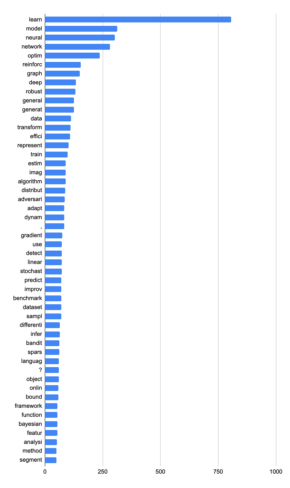
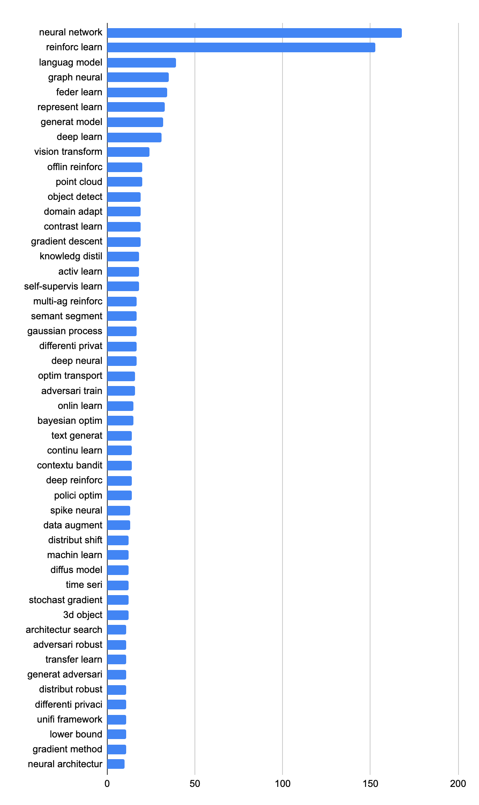
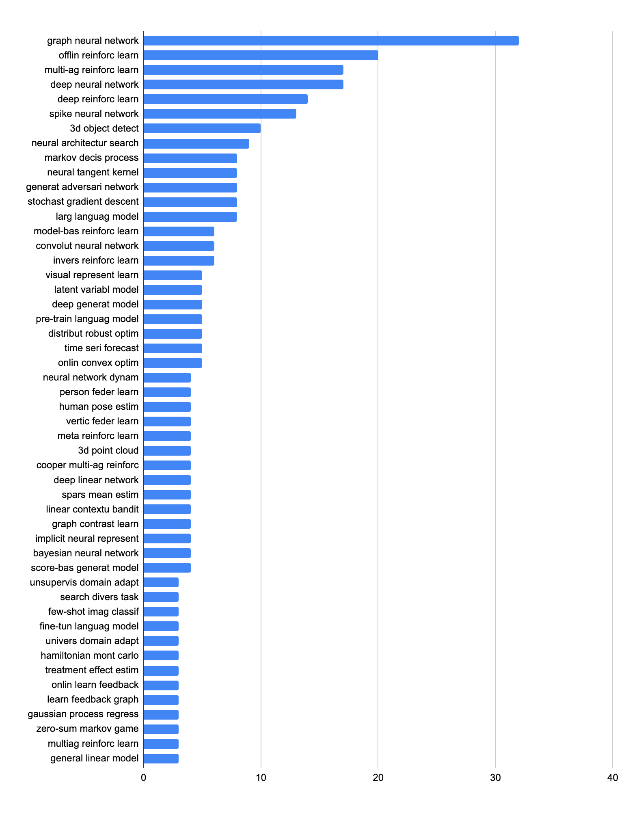

# neurips2022_analysis

This repo contains the crawling and visualization scripts to statisticize the number of accepted NeurIPS 2022 papers.

## Data

- The data is crawled from [https://nips.cc/Conferences/2022/Schedule?type=Poster](https://nips.cc/Conferences/2022/Schedule?type=Poster)
on Oct 27, 2022, KST. using `./crawl_data.py`.
- The data including titles, authors, and affiliations is dumped to `./data`.

## Top 50 N-grams

Full lists are in this [spreadsheet](https://docs.google.com/spreadsheets/d/1njMPAINvEHDxtzHR2aZgzFml1Poda5ngqbaKsmPTQnU/edit#gid=1551968858).

